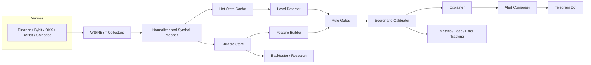
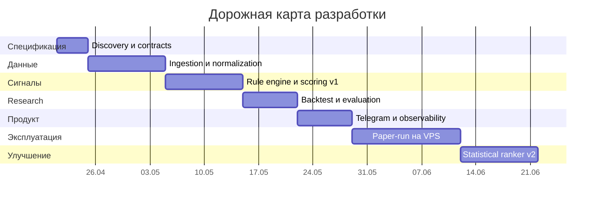

# Telegram-бот на Python для криптоалертов по пробоям и отскокам от уровней

## Резюме для принятия решения

Для задачи «уровневый» Telegram-бот на VPS я бы не начинал с глубокой нейросети. На практике самый разумный путь выглядит так: сначала собрать надежный конвейер данных из нативных WebSocket/REST API бирж, затем реализовать объяснимый rule-based движок по уровням, а уже поверх него добавить статистический ранжировщик вероятности успеха сигнала. Такой порядок дает наилучшее соотношение скорости запуска, контролируемости, интерпретируемости и качества. Официальные API крупнейших бирж уже отдают все ключевые сущности, которые нужны для такой системы: свечи, сделки, стакан, funding, open interest, index/mark price и смежные market-data каналы; для Telegram есть как long polling, так и webhook; для Python доступны зрелые async-фреймворки и библиотеки наблюдаемости. citeturn26view3turn26view0turn26view1turn3view12turn23search0turn3view0turn3view2turn3view4turn5search1turn10view0turn3view9

Если цель — именно алерты, а не fully automated execution, то лучшая базовая конфигурация — это реальное время только по ликвидным инструментам, умеренная глубина стакана, мульти-таймфреймовая логика уровней и обязательная текстовая причина сигнала. В качестве первого production-приближения я рекомендую: уровни строить на 4h/1h, подтверждение брать на 15m/5m, а микроструктуру стакана и поток сделок подключать только вокруг кандидатов на пробой/отскок, чтобы не перегружать VPS и не упираться в rate limits без необходимости. Исследования по support/resistance и microstructure показывают, что сами уровни могут быть информативны, а дисбаланс очереди и order-flow imbalance действительно несут краткосрочную прогностическую информацию; но сила отдельных «ручных» оценок уровня часто переоценивается, поэтому лучше опираться не на один индикатор, а на ансамбль признаков с калиброванной вероятностью. citeturn29view0turn29view1turn28view1turn20search1turn20search2turn22search1turn22search2turn19search12

Практически это означает такой целевой стек: native exchange adapters для основных бирж, Redis как hot-state/cache, PostgreSQL или Timescale/Parquet как durable-хранилище, aiogram как Telegram-слой, FastAPI для health/admin API, Prometheus + Grafana для метрик и Sentry для исключений. На VPS это удобно разворачивать через Compose; для самого бота проще стартовать с polling, а webhook подключать, если понадобятся публичный HTTPS endpoint, строгий входящий контроль и более «серверный» режим эксплуатации. citeturn3view12turn23search0turn22search11turn25search3turn25search2turn25search0turn26view0turn26view1

## Логика пробоев и отскоков от уровней

Поддержка и сопротивление полезны не как «магические линии», а как зоны вероятностной смены поведения рынка. Классическая логика проста: support/resistance дают области, где импульс часто замедляется, останавливается или разворачивается; breakout возникает, когда цена выходит за такую область и удерживается вне нее; fakeout — когда выход быстро ломается и возвращается внутрь диапазона. В образовательных материалах бирж это формулируется именно так, а в более строгих исследованиях по валютному рынку показано, что опубликованные уровни значимо чаще, чем случайные, совпадали с внутридневными остановками тренда; при этом «оценки силы» уровней сами по себе оказывались слабо полезными, что очень важно для дизайна алерт-бота. citeturn18search4turn18search2turn18search6turn29view0turn29view1

Еще одно важное наблюдение: support/resistance хорошо сочетаются с микроструктурой, потому что уровни часто совпадают с пиками глубины стакана. Это означает, что для инженерного дизайна бота есть смысл связывать price-action вокруг уровня с локальной ликвидностью, а не смотреть только на свечи. Дополнительную поддержку такой идее дают работы по queue imbalance и order flow imbalance: дисбаланс bid/ask очередей и поток ордеров способен объяснять very short-term изменения mid-price, а более новые крипто-ориентированные работы показывают, что engineered order-book и trade features в крипторынке имеют устойчивые SHAP-паттерны между активами. citeturn28view1turn20search1turn20search2turn19search12

Для бота такого типа я бы свел стратегический обзор к четырем семействам сигналов.

| Семейство сигнала | Что подтверждает идею | Где работает лучше | Где ломается чаще |
|---|---|---|---|
| Пробой закрытием | Закрытие свечи за зоной, расширение диапазона, рост объема, отсутствие быстрого возврата | трендовые фазы, ликвидные пары, 15m/1h | тонкий рынок, новости, low-liquidity altcoins |
| Пробой с ретестом | Сначала выход из зоны, затем обратный тест уровня и удержание | наиболее устойчивый real-time паттерн для алертов | сильный momentum без ретеста, ложные проколы |
| Отскок от уровня | Прокол уровня тенью, закрытие обратно в зону, замедление импульса | диапазоны, mean-reversion, 5m/15m у сильных HTF-уровней | сильный направленный тренд и «ломающий» order flow |
| Ложный пробой/fakeout | Выход за уровень, быстрая отмена, поток сделок/стакан не поддерживают импульс | границы диапазонов, session high/low, previous day high/low | при новостных импульсах и каскадных стопах |  
Практический смысл fakeout и breakout как разных сценариев хорошо отражен в официальной терминологии и базовых explainers бирж. citeturn18search2turn18search6turn18search4

С точки зрения признаков, минимальный полезный набор для уровневого бота должен покрывать четыре группы. Первая — price action: расстояние до уровня, размер тела свечи, длина теней, количество касаний, давность уровня, close location value, серия higher highs / lower lows. Вторая — volatility/trend: ATR для нормализации буферов и стопов, EMA/SMA и их наклон, Bollinger Bands как контекст расширения/сжатия волатильности, RSI как индикатор истощения/дивергенции, VWAP как якорь «справедливой» цены внутри сессии. Третья — participation: volume z-score, taker buy/sell volume, число сделок, turnover. Четвертая — microstructure/derivatives: bid/ask imbalance, spread, refill/absorption после прокола, open interest, funding, basis, mark/index divergence. Такой стек соответствует и классической TA-логике, и доступным полям из официальных API. citeturn21search0turn21search2turn30search0turn30search2turn30search4turn30search7turn3view2turn3view4turn3view5turn10view0turn10view2

По таймфреймам лучше всего работает разделение ролей. HTF-уровни следует искать на 4h и 1h, потому что там меньше шум и лучше видно структурные high/low, предыдущие экстремумы, VWAP-зоны и устойчивые разворотные области. Входную валидацию стоит делать на 15m и 5m. Данные стакана и потока сделок нужны не непрерывно по всему universe, а событийно — когда цена находится, например, в пределах 0.25–0.5 ATR от кандидата-уровня. Такой дизайн резко снижает вычислительную и сетевую нагрузку без потери смысла. Официальные WebSocket-каналы бирж позволяют делать именно такую событийную подписку и работать с закрывающимися/подтвержденными свечами. citeturn8view4turn13view4turn31view2turn31view3

Правила риска для алерт-бота должны быть встроены в сам сигнал, иначе explainability всегда будет неполной. Я бы использовал следующие стартовые нормы: риск на идею 0.25–0.75% от условного капитала модели; стоп не «по числу процентов», а за invalidation point уровня плюс буфер 0.1–0.3 ATR; минимальный целевой risk/reward не ниже 1:2, лучше 1:2.5 или 1:3 для сигналов higher-confidence; дневной лимит убыточности в paper/live-симуляции — 2–3R; отключение новых алертов при stale market data, разрыве последовательностей стакана или резком расширении spread/slippage режима. Это хорошо согласуется с базовой практикой stop-loss, take-profit, ATR и risk/reward planning. citeturn21search1turn21search3turn21search8turn21search0

## Источники данных и API

Главный принцип выбора данных здесь простой: для production-сигналов первичны нативные API бирж, а абстракции и агрегаторы нужны либо для ускорения прототипа, либо как fallback и исследовательский слой. Нативные API дают более точный контроль над глубиной стакана, heartbeat/reconnect, exchange-specific полями и rate limits; универсальные слои снижают сложность интеграции, но сглаживают различия между venues и часто прячут важные для микроструктуры нюансы. citeturn31view0turn31view1turn31view2turn31view3

Ниже — практический приоритет источников для такого бота.

| Источник | Что брать | Плюсы | Минусы | Приоритет |
|---|---|---|---|---|
| **entity["company","Binance","crypto exchange"]** | Spot/Futures candles, diff depth, trades, funding history, OI, taker buy/sell volume, basis, public data dump | очень богатые market-data API, официальные Python-коннекторы, исторические daily/monthly datasets | много exchange-specific нюансов; строгий контроль rate limits; для локального стакана нужна корректная синхронизация snapshot+delta | **Очень высокий** |
| **entity["company","Bybit","crypto exchange"]** | Spot/linear/inverse kline, orderbook, trades, funding history, OI, mark/index klines | хорошие public WS каналы, сильное покрытие деривативов, официальный pybit | собственные ограничения по IP/WS, требуется heartbeat и контроль snapshot/delta | **Очень высокий** |
| **entity["company","OKX","crypto exchange"]** | books/books5/bbo-tbt, candlesticks, funding/open-interest channels, mark price | сильная market-data модель, несколько режимов глубины стакана, официальный Python SDK | документация богата, но сложнее по каналам и типам данных; много venue-specific правил | **Высокий** |
| **entity["company","Deribit","crypto derivatives"]** | perpetual/futures market data, funding history, ticker with mark/open interest, chart data, book subscriptions | очень сильный derivatives-first API и хорошие best practices по market data | покрытие уже, чем у крупных spot+perp venues; основной фокус BTC/ETH derivatives | **Высокий для деривативов** |
| **entity["company","Coinbase","crypto exchange"]** | public order book, candles, trades, WebSocket market data | полезен как USD-референс и дополнительная spot-площадка | public endpoints кэшируются на 1 секунду; для real-time нужна ставка на WebSocket | **Средний** |
| **entity["company","CoinGecko","crypto data aggregator"]** | discovery, metadata, агрегированные OHLC/история, резервный источник | быстрое покрытие большого universe и удобный fallback для research | не должен быть primary source для venue-level стакана и микроструктуры | **Низкий как primary, полезный как fallback** |  
Поддержка этих тезисов есть в официальных API-документациях и справочниках. citeturn3view0turn3view2turn12view4turn12view1turn8view0turn3view4turn3view5turn8view3turn5search1turn13view0turn13view3turn13view4turn3view7turn10view0turn10view1turn10view2turn3view8turn3view9turn4view4

С практической точки зрения я бы дал такой порядок внедрения. Для MVP: Binance + Bybit. Для production-lite: добавить OKX. Для деривативного контекста высокого качества по BTC/ETH: добавить Deribit. Coinbase полезен не как основной генератор алертов, а как дополнительная spot-точка наблюдения и sanity-check для USD-пар. CoinGecko разумно держать как auxiliary research layer, а не как торговый источник первого класса. citeturn3view0turn8view0turn13view0turn10view3turn3view9turn4view4

Отдельно стоит разделить **exchange data sources** и **Python access layers**.

| Слой доступа | Что дает | Когда брать | Компромиссы |
|---|---|---|---|
| Native SDKs / official connectors | наиболее полный доступ к venue-specific полям и режимам WS/REST | production, order book, funding/OI, тонкая настройка reconnect | больше кода и больше ветвлений по биржам |
| CCXT REST | единый интерфейс к fetchMarkets/fetchOHLCV и common methods | быстрый прототип, batch-исследование, унификация символов | теряются многие exchange-specific особенности |
| CCXT Pro | единый websocket-слой: watchOrderBook/watchOHLCV/watchTrades | быстрый real-time prototype или mid-tier production | платный слой и компромисс между унификацией и полным контролем |  
Это следует из структуры unified API и WebSocket watch-методов CCXT/CCXT Pro. citeturn31view0turn31view1turn31view2turn31view3turn31view4

Из русскоязычных официальных материалов реально полезны, но их немного: у Bybit есть русская справка по funding-rate механике, а у Binance — русская tutorial-статья по локальному order book и русские глоссарии по объему и fakeout. Почти вся «бо́евая» API-документация у топ-бирж при этом англоязычная, и это надо учитывать в разработке и сопровождении. citeturn16search4turn18search1turn18search19turn18search6

## Алгоритмические подходы и объяснимость

Для такой системы полезно мыслить не «одним алгоритмом», а каскадом. Лучший практический вариант — three-stage pipeline: сначала **детектор уровней**, затем **gate/filters**, затем **scorer/ranker**. Детектор создает кандидатов на уровень; фильтры проверяют обязательные условия сценария; scorer выдает confidence score и текстовую декомпозицию решения. Такой каскад лучше, чем «одна большая модель», потому что проще отлаживается, меньше страдает от leakage и естественно дает explainable rationale для Telegram-алерта. citeturn29view0turn20search1turn22search1turn22search2

| Подход | Что именно моделирует | Базовые признаки | Как считать score | Как объяснять |
|---|---|---|---|---|
| Rule-based | логическое выполнение сценария breakout/bounce | HTF-уровень, ATR, volume z-score, close beyond/inside zone, wick/body, spread, OI/funding | взвешенная сумма 0–100 + hard gates | вклад каждого правила, список сработавших и несработавших условий |
| Статистический | вероятность того, что сигнал дойдет до цели раньше стопа | все rule-features + lagged returns + regime features | logistic regression / calibrated probability | коэффициенты, odds-ratio, калибровочный confidence |
| Gradient boosting | нелинейные взаимосвязи между price-action, объёмом, стаканом и derivatives | расширенный feature-set, cross-features, rolling z-scores | XGBoost/GBDT + isotonic/sigmoid calibration | SHAP top features, local feature contribution |
| Sequence / deep LOB | очень краткосрочное направление после касания уровня | последовательности top-N book states, trades, OFI, imbalance | probability of follow-through / bounce over short horizon | через SHAP-суррогат, feature attribution или surrogate tree; наименее прозрачный вариант |  
Инструменты для calibrated probabilities и SHAP в Python официально поддерживаются, а tree-based boosting и logistic regression достаточно зрелые для VPS-уровня. citeturn24search3turn24search0turn22search1turn22search9turn22search2turn22search6

Мой рекомендуемый порядок — **rule-based first, statistical second, deep LOB last**. Причина в том, что у вас задача на explainable alerts, а не на HFT execution. Следовательно, модель должна не просто «угадывать up/down», а отвечать на вопрос: почему именно сейчас, почему именно этот уровень, и что делает сигнал неидеальным. Для этого logistic regression и gradient boosting почти всегда полезнее стартовой LSTM/Transformer-схемы. Новые крипто-микроструктурные исследования показывают, что инженерно созданные book/trade features и так дают устойчивую объяснимость через SHAP — то есть до sequence model можно и не доходить на первой версии. citeturn19search12turn22search2turn24search3turn24search0

Ниже — предлагаемая мною спецификация feature groups и стартовых весов для **breakout**:

- **Качество уровня — 25%**: число касаний, «возраст» уровня, совпадение с previous day/week high-low, близость к HTF VWAP/ключевому экстремуму.  
- **Подтверждение цены — 25%**: закрытие выше/ниже зоны не менее чем на 0.10–0.25 ATR, относительный размер тела свечи, отсутствие длинной обратной тени.  
- **Участие рынка — 20%**: volume z-score, taker imbalance, turnover spike, число сделок на свече.  
- **Микроструктура — 15%**: top-5 либо top-10 book imbalance, micro-spread, refill/absorption после прокола.  
- **Деривативный контекст — 15%**: изменение OI, funding, basis, mark/index context.  

Стартовый расчет может быть таким:

\[
score_{breakout}=100 \times \sum w_i \cdot f_i
\]

где \(f_i \in [0,1]\), а hard gates — обязательны:  
\(close\_beyond\_level=1\), \(volume\_z \ge 1.5\), \(data\_fresh=1\), sequence-gap в стакане отсутствует.  
Рекомендуемые пороги: **80+** — actionable alert, **65–79** — watchlist alert, ниже **65** — не публиковать. Это уже не «факт из источника», а инженерная стартовая спецификация, которую нужно калибровать под ваш universe. Поддерживающие признаки и их доступность опираются на официальный market-data coverage бирж. citeturn3view2turn3view4turn3view5turn10view0turn10view2turn21search0turn21search2

Для **bounce** я бы менял приоритеты. Там важнее не просто касание, а **отмена попытки**: прокол тенью, close back inside zone, резкое ухудшение follow-through, поглощение агрессии в стакане, падение/пауза OI при «пробое без продолжения», divergence по RSI либо volume exhaustion. Стартовый hard gate для bounce: проникновение в уровень, но закрытие обратно в зону; rejection-wick заметно больше тела; не менее одного признака absorption/refill в стакане; до ближайшей цели есть хотя бы 1.5R пространства. Такой сценарий напрямую связан с типологией fakeout и failed breakout. citeturn18search6turn20search1turn20search2turn30search0

Для обучения вероятностной модели сигналов нужно заранее определить label. Я бы использовал **event-based labeling**:  
- **успешный breakout** — если после алерта цена достигает либо \(+1.5\) ATR, либо целевого \(R\)-мультипликатора до того, как вернется и закроется обратно внутри зоны/ударит стоп;  
- **успешный bounce** — если после rejection цена проходит минимум \(+1.0\)–\(1.5\) ATR от уровня в сторону отскока до инвалидатора.  

Confidence score следует делать не сырым output модели, а **калиброванной вероятностью**. В Python это естественно реализуется через sigmoid/Platt либо isotonic calibration на out-of-fold данных, а качество confidence потом проверяется по Brier score и calibration curve. citeturn22search1turn22search9turn27search3

Explainability по уровням я бы делал в трех слоях. Первый слой — **локальные rule contributions**: «+14 баллов за закрытие выше уровня, +11 за volume spike, −7 за перегретый funding». Второй — **вероятностный**: «модель оценивает вероятность follow-through в 0.74 после калибровки». Третий — **ML-friendly**: SHAP top-5 features для каждого алерта и monthly global importance report по символам. Это даст и читаемый Telegram-текст, и нормальный инженерный контур диагностики drift/regime change. citeturn22search2turn22search6turn19search12

## Архитектура бота и развёртывание на VPS

Архитектура для такого проекта должна быть событийной, но не чрезмерно микросервисной. Для одного VPS оптимальна схема «несколько процессов/сервисов, но один репозиторий и один orchestration file». Основные блоки: ingestion, normalization/state, signal engine, backtester/research layer, alert composer, Telegram bot interface и observability. Официальные инструменты Python и Telegram это хорошо поддерживают: aiogram и python-telegram-bot полностью асинхронны; FastAPI заточен под async/await; Telegram Bot API поддерживает и long polling, и webhook; Prometheus Python client нативно инструментирует Python-сервисы, а Compose удобно собирает многоконтейнерную схему на VPS. citeturn3view12turn3view13turn23search0turn23search4turn26view0turn26view1turn22search11turn25search0



Для Python-стека я бы рекомендовал следующий набор.

| Компонент | Предпочтение | Почему |
|---|---|---|
| Telegram framework | **aiogram** для data-heavy async-бота; **python-telegram-bot** если нужен чуть более «классический» DX | обе библиотеки асинхронны, но aiogram обычно чуть лучше «садится» на многопоточный/async ingestion-вокруг event loop |
| Exchange access | **Native SDKs** для production; **CCXT/CCXT Pro** для прототипа и research | меньше потерь в venue-specific деталях и лучшая управляемость market data |
| Admin/API | **FastAPI** | простой async API для healthcheck, metrics proxy, manual re-run и debug endpoints |
| Hot state | **Redis** | быстрый state around current candles/order books/last alerts |
| Durable store | **PostgreSQL + Parquet** | SQL для событий и сигналов, Parquet для research/backtest snapshots |
| Backtesting | **vectorbt** для массовых параметров; **backtrader** для event-driven симуляции; **Freqtrade tools** как дополнительный research helper | у каждого своя роль, и все три инструмента полезны, но не одинаково |
| Monitoring | **prometheus-client + Grafana**, опционально **Sentry** | метрики, дашборды, latency/error tracking |  
Сильные стороны библиотек и тулов отражены в их официальной документации. citeturn31view0turn31view2turn31view3turn3view12turn3view13turn23search0turn23search1turn23search2turn23search3turn27search18turn22search11turn25search3turn25search2

На уровне процессов я бы разделил приложение на пять сервисов:  
**collector** — держит WS/REST-соединения и пишет нормализованные события;  
**engine** — строит уровни, признаки и score;  
**bot** — принимает команды и отправляет алерты;  
**api** — health, metrics, administrative endpoints;  
**monitoring** — Prometheus/Grafana при необходимости.  
Redis нужен для горячего состояния и дедупликации, долговременное хранилище — для backtest/live-audit trail. Это deliberately simple: на одном VPS такое проще сопровождать, чем дробить на Kubernetes-style микросервисы. Поддерживающие средства контейнеризации и service management для этого стандартны. citeturn25search0turn25search1turn25search3

По развёртыванию я бы советовал два режима. **MVP/ранняя production** — polling: меньше внешней сетевой поверхности, не нужен публичный HTTPS endpoint, проще локальная отладка. **Более зрелый production** — webhook за reverse proxy: Telegram сам POST’ит апдейты, есть secret token, можно ограничивать allowed_updates и управлять max_connections. Официально Telegram прямо поддерживает оба режима, у webhook есть secret_token и ограничения по портам, а при активном webhook polling выключается. citeturn26view0turn26view1turn26view2

Для VPS по ресурсам уместны такие ориентиры как **инженерная оценка**, а не hard requirement. REST/closed-candle MVP на 20–40 символов обычно комфортно живет на 2 vCPU / 4 GB RAM. Реальное время с несколькими venues, Redis, durable store и мониторингом я бы планировал на 4 vCPU / 8–16 GB RAM. Если вы будете держать deep L2 стакан по десяткам символов непрерывно, верхняя граница быстро вырастет; именно поэтому событийная подписка «только рядом с уровнем» так важна.

## Тестирование, бэктест и метрики

Тестировать нужно не только стратегию, но и весь pipeline. Для такой системы я бы разбил QA-контур на четыре уровня: **data quality**, **unit/integration**, **historical simulation**, **paper/live shadowing**. Это важнее, чем «натравить модель на год исторических свечей», потому что в реальности у уровневого бота половина проблем рождается не в alpha-логике, а в stale data, разъехавшихся symbol maps, пропусках дельт стакана, дубликатах алертов и time-sync ошибках. Рекомендации по проверке lookahead/recursive bias, time-series split и probability calibration доступны в зрелых документациях research-инструментов и ML-библиотек. citeturn22search0turn27search0turn27search1turn22search1

На уровне данных обязательны автоматические тесты на: монотонность timestamp, дубликаты свечей, полноту полей, согласованность symbol metadata, stale-stream detection, gap detection по sequence/change_id для стакана, корректный ресинк snapshot+delta, контроль timezone и server time offset. Без такого слоя backtest почти всегда оказывается «красивее», чем реальная эксплуатация. Официальные биржевые docs прямо описывают sequence-правила, ping/pong и местами рекомендуют WebSocket как основной источник данных вместо частого polling. citeturn11search1turn8view0turn10view4turn12view1turn12view3turn8view2

Для исторической проверки я бы использовал **walk-forward** и/или **anchored TimeSeriesSplit**, а не случайные train/test split. Если в research-контуре есть векторизованные вычисления по полному DataFrame, нужно отдельно проверять lookahead bias и recursive bias: такие ошибки особенно часто возникают в расчете rolling-indicators, future-return labels и случайном использовании будущих свечей в логике сигнала. Для удобства такие проверки можно автоматизировать рядом с backtest CI job. citeturn22search0turn27search0turn27search1

Метрики должны быть двойными: **forecasting metrics** и **trading metrics**.

| Категория | Что мерить | Зачем |
|---|---|---|
| Классификация | precision, recall, precision-recall curve, average precision | у алертов классы обычно дисбалансны, и PR-метрики важнее accuracy |
| Калибровка | Brier score, calibration curve | confidence score должен быть похож на вероятность, а не на «красивую шкалу» |
| Торговое качество | hit rate, expectancy, average R, max adverse excursion, max favorable excursion, payoff ratio | показывает реальную экономику сигнала, а не только бинарную метку |
| Операционка | median alert latency, stale-data ratio, duplicate-alert rate, WS reconnect count, Telegram delivery errors | проверяет пригодность системы к эксплуатации |  
Определения precision/recall и Brier официально стандартизованы в scikit-learn, а PR-подход особенно полезен на несбалансированных задачах. citeturn27search5turn27search20turn27search3

Для публикации в прод я бы ставил не только количественные, но и процедурные критерии: минимум 2–4 недели dry-run/paper-trading на VPS; сохранение audit trail для каждого сигнала; ручной разбор хотя бы 100–200 срабатываний; monthly review по top false positives / false negatives; отключение слабых символов и режимов. Если добавляется ML-слой, то отдельно нужен drift review: меняются ли важности признаков, не поплыл ли Brier score, не деградировал ли ranking quality после смены рыночного режима. SHAP и калибровка здесь полезны не только для пользователя, но и для вашей собственной модели-мониторинга. citeturn22search2turn22search1turn27search3

## Формат алерта и эксплуатационная надежность

Хороший алерт должен быть коротким, но объяснимым и проверяемым. В нем пользователю нужны не только direction и таймфрейм, но и: от какого уровня сигнал, чем подтвержден, что его инвалидирует, почему confidence именно такой и что мешает ему быть выше. Это естественно следует из дизайна calibrated+explainable signal engine и из доступных полей market data. citeturn22search1turn22search2turn3view2turn3view4turn10view2

Ниже — рекомендуемый шаблон алерта.

```text
🚨 {symbol} | {BREAKOUT/Bounce} | {LONG/SHORT} | {timeframe}
Confidence: {0-100}

Level:
{price_zone} | HTF source: {4h/1h previous high-low / swing / VWAP}

Trigger:
{e.g. 15m close 0.18 ATR above resistance}
{or wick sweep + close back inside level}

Rationale:
• Volume z-score: {value}
• Book imbalance: {value}
• OI change: {value}
• Funding / basis context: {value}
• Retest / rejection confirmation: {yes/no}

Invalidation:
• Stop logic: {below/above level + ATR buffer}
• Cancel if: {two closes back inside zone / stale data / spread spike}

Targets:
• T1: {price}
• T2: {price}
• Expected R:R: {value}

Why confidence is not higher:
• {e.g. funding crowded, weak confirm volume, cross-venue disagreement}

Data health:
• Freshness: {ms}
• Venues used: {list}
• Sequence gaps: {none / recovered}
```

Именно такой шаблон лучше всего связывает стратегию, риск и explainability в одном сообщении. Пользователь сразу видит, к какому уровню относится сигнал, почему это breakout/bounce, какой есть контекст по объему/стакану/деривативам и где лежит invalidation point. Это намного полезнее, чем «BTCUSDT LONG 78%». citeturn20search1turn20search2turn22search1turn22search2

Эксплуатационные меры безопасности и надежности я бы свел в следующую матрицу.

| Область | Практика | Основание |
|---|---|---|
| Telegram security | использовать `secret_token` в webhook; ограничивать `allowed_updates`; для MVP можно остаться на polling | Telegram Bot API это поддерживает из коробки |
| Telegram rate limits | не spam’ить: учитывать лимиты на сообщения в chat/group/broadcast и обрабатывать 429 | официальная Bot FAQ прямо предупреждает об этих ограничениях |
| Exchange secrets | если бот только алертит, не выдавать ему торговые права вообще; если private endpoints понадобятся позже — отдельные ключи и минимум permissions | биржи поддерживают API-key security scopes/permissions |
| Rate-limit hygiene | default — WebSocket для market data; REST только для backfill/snapshots; централизованный throttle и backoff по 429/Retry-After | этого прямо требуют официальные docs бирж |
| WS reliability | heartbeat, reconnect with jitter, forced 24h reconnect там, где это требуется, local-book resync при gap | documented behavior у Binance/Bybit/Deribit |
| State integrity | дедупликация алертов по stable key, idempotent send, persistent outbox, frozen mode при stale data | инженерная best practice для alerting systems |
| Failure isolation | разделить соединения heavy market data и bot/order/admin трафик | Deribit прямо рекомендует separate connections для heavy subscriptions |
| Auditability | хранить каждый сигнал, feature snapshot, rule contributions, Telegram delivery status | обязательно для тюнинга и post-mortem |  
Поддерживающие официальные источники по безопасности, лимитам и сетевому поведению приведены ниже. citeturn26view1turn26view2turn3view11turn12view1turn12view2turn12view3turn8view1turn8view2turn10view4

Особенно критичны три вещи. Первая — **правильное ведение локального стакана**: snapshot+delta, sequence IDs, reset/re-subscribe при пропуске. Вторая — **clock and freshness discipline**: server time drift, forced reconnect, stale-feed cutoff. Третья — **circuit breakers**: если data health ниже порога, новые алерты временно блокируются. Без этих трех вещей «объяснимый бот» быстро превращается в «бот с уверенным тоном и случайными сообщениями». citeturn11search1turn8view0turn10view4turn12view3

## Варианты реализации и дорожная карта

Ниже — четыре реалистичных варианта, из которых я бы рекомендовал **второй как базовый** и **третий как следующий этап**.

| Вариант | Что входит | Сильные стороны | Слабые стороны | Оценка effort |
|---|---|---|---|---|
| Легкий MVP | CCXT REST, closed-candle logic, уровни 1h/15m, aiogram polling, без L2 стакана | самый быстрый старт, низкая стоимость VPS, простая отладка | слабая микроструктура, хуже тайминг, больше ложных пробоев | 2–3 недели |
| Rule-based real-time | native WS/REST, уровни 4h/1h + 15m/5m, candidate-driven order book, Redis, durable store, aiogram/FastAPI | лучший баланс качества, explainability и простоты эксплуатации | больше кода на интеграции и ресинк | 5–7 недель |
| Hybrid ranker | все из предыдущего + logistic/XGBoost scorer, calibration, SHAP, drift review | лучше ranking и confidence, понятная explainability | сложнее research/MLOps, больше требований к feature discipline | 7–9 недель |
| Full microstructure ML | глубокий L2/L3 research, sequence model, surrogate explainability | максимальный research upside | сложный data engineering, opaque behavior, выше нагрузка на VPS и операционный риск | 10–14 недель |  
Именно async bot frameworks, native exchange APIs, backtesting frameworks и calibrated/SHAP tooling задают границы этих оценок. citeturn3view12turn23search0turn31view2turn31view3turn24search3turn24search0turn22search1turn22search2turn23search1turn23search2turn23search3

Если выбирать один путь, я бы советовал такой:  
**выбрать вариант “Rule-based real-time” как основной**, затем после 2–4 недель paper-run добавить **Hybrid ranker**. Это наилучший компромисс между инженерной устойчивостью и реальным улучшением качества алертов.

Мой пошаговый план разработки для одного инженера выглядит так.

| Этап | Что делается | Deliverables | Оценка |
|---|---|---|---|
| Discovery и data contracts | universe, биржи, symbol map, schema, definition of success/failure для signals | спецификация датасета, risk/rationale schema, API matrix | 3–4 дня |
| Ingestion и normalization | collectors, snapshots/deltas, candles/trades/funding/OI, Redis state | работающий data pipeline, storage schema, freshness checks | 1–1.5 недели |
| Signal engine | detection of levels, breakout/bounce rules, hard gates, initial score | engine v1, explainable rule contributions, dry signal logs | 1–1.5 недели |
| Backtester и evaluation | event-based backtest, walk-forward, precision/PR/Brier, bias checks | research notebook, benchmark report, tuned thresholds | 1 неделя |
| Telegram и observability | bot commands, alert template, metrics, dashboards, exception tracking | production-ready bot UX, Grafana/Prom metrics, error reporting | 1 неделя |
| Paper-run на VPS | live dry-run, false-positive review, symbol pruning, circuit-breakers | go/no-go report, tuned symbol list, ops playbook | 2 недели |
| Statistical upgrade | logistic/XGBoost, calibration, SHAP, drift reporting | scorer v2, calibrated confidence, monthly model diagnostics | 1–2 недели |

Диаграмма ниже показывает реалистичный график.



Как practical outcome, у вас к концу базового цикла должны быть не «много кода» и не «модель, которая что-то предсказывает», а вполне конкретные deliverables:  
рабочий data layer, документированная логика уровней, reproducible backtest, Telegram-шаблон с explainability, VPS deployment file, metrics dashboards, ops playbook и список символов/режимов, которые реально проходят по качеству. Именно это делает проект управляемым.